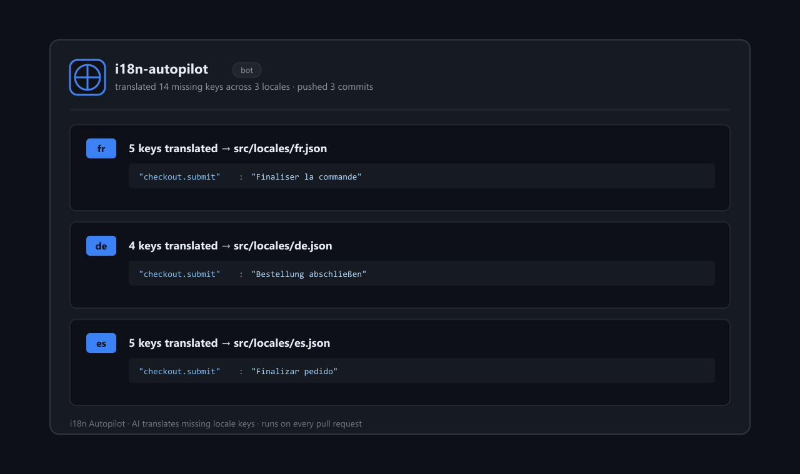

# 🌍 i18n Autopilot

[](https://github.com/marketplace/actions/i18n-autopilot)
[](LICENSE)

**Auto-translate your missing i18n keys on every pull request — powered by AI.**

Stop manually copying new strings into every locale file. When a pull request adds
or changes keys in your source language, i18n Autopilot detects what's missing in
every other locale, translates it, and commits the result back to the PR with a
summary comment. Placeholders and HTML are preserved.



> **Two ways to use it**
> - 🆓 **Free GitHub Action** (this repo) — bring your own OpenAI key. Setup below.
> - ⚡ **Hosted Pro** — no API key, no CI setup, unlimited keys. [Install the app →](https://github.com/apps/i18n-autopilot) · [Dashboard](https://i18n.useautopilot.dev/dashboard)

---

## Quick start

1. Add your translation provider key as a repository secret named `OPENAI_API_KEY`
   (**Settings → Secrets and variables → Actions**).
2. Create `.github/workflows/i18n.yml`:

```yaml
name: i18n Autopilot

on:
  pull_request:
    paths:
      - "locales/**"

permissions:
  contents: write
  pull-requests: write

jobs:
  translate:
    runs-on: ubuntu-latest
    steps:
      - uses: actions/checkout@v4
        with:
          ref: ${{ github.event.pull_request.head.ref }}
      - uses: isabellehuecloser-ctrl/i18n-autopilot@v0
        with:
          source-locale: en
          locales-dir: locales
          api-key: ${{ secrets.OPENAI_API_KEY }}
```

That's it. Open a PR that adds a key to `locales/en.json` and watch the other
locales fill in automatically.

---

## Supported layouts

**Flat** — one file per locale:

```
locales/
  en.json
  fr.json
  de.json
```

**Nested namespaces** — one folder per locale (e.g. react-i18next):

```
locales/
  en/
    common.json
    auth.json
  fr/
    common.json
    auth.json
```

The layout is detected automatically from your `source-locale`.

---

## Inputs

| Input           | Required | Default        | Description                                                        |
| --------------- | -------- | -------------- | ------------------------------------------------------------------ |
| `api-key`       | yes      | —              | Provider API key (OpenAI). Pass via a repository secret.           |
| `source-locale` | no       | `en`           | Reference locale containing the source-of-truth keys.              |
| `locales-dir`   | no       | `locales`      | Directory holding your locale files.                               |
| `model`         | no       | `gpt-4o-mini`  | Model used for translation.                                        |
| `commit`        | no       | `true`         | Commit the generated translations back to the PR branch.           |
| `github-token`  | no       | workflow token | Token used to commit and comment.                                  |

## Outputs

| Output            | Description                                  |
| ----------------- | -------------------------------------------- |
| `translated-keys` | Total number of keys translated across locales. |

---

## How it works

1. Reads the source locale and flattens it to dot-notation keys.
2. For every other locale, finds keys that are missing or empty.
3. Translates only those values, preserving placeholders (`{name}`, `{{count}}`,
   `%s`, `:id`) and HTML tags.
4. Merges the translations back, commits to the PR branch, and posts a summary.

You bring your own provider key, so translation runs on your account — no data
passes through any third-party service besides your chosen AI provider.

---

## Roadmap

- Additional providers (DeepL, Anthropic)
- Glossary / do-not-translate terms
- Tone and formality controls
- Hosted Pro version with usage dashboard

## Show it off

Using i18n Autopilot? Add the badge to your README so visitors know your locales
stay in sync automatically:

[](https://github.com/marketplace/actions/i18n-autopilot)

```md
[](https://github.com/marketplace/actions/i18n-autopilot)
```

## License

MIT © Isabelle Hue
